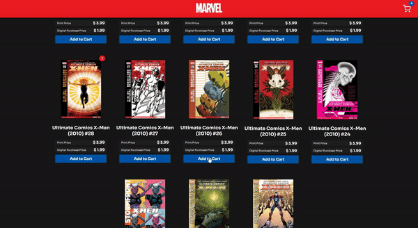

# Muutus Challenge

The Coding Challenge given to me was to create a basic e-commerce website with the Marvel API. In this challenge I implemented the products page, and a fully functional cart page.

  

## [Try it out here](https://mutuus-challenge.web.app/ "Homepage")

### Installation

Clone the repository, run `yarn && yarn start` on the react folder, and it will be available for you on your localhost.

### What I Used on this project

- React
- React Hooks
- Redux
- Redux Hooks
